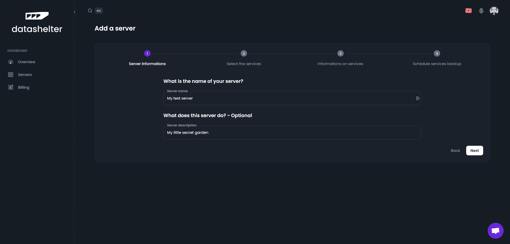
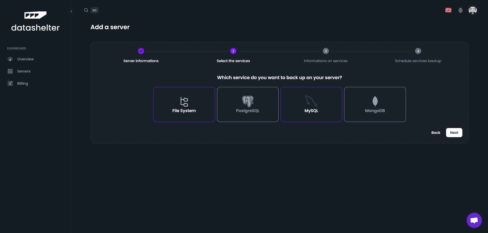
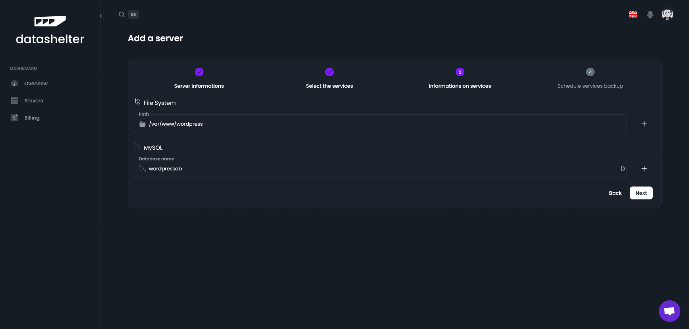

# Quickstart

## Créez un compte sur Datashelter

Créez un compte sur [app.datashelter.tech](https://app.datashelter.tech)


## Ajouter votre premier serveur

Ajoutez votre premier serveur sur le tableau de bord. Vous serez invité à installer le CLI snaper sur votre serveur et à le configurer.


1. **Cliquez sur le bouton "Ajouter un serveur"**


2. **Définissez le nom du serveur et une description**


3. **Sélectionnez les services que vous souhaitez sauvegarder**


4. **Remplir les informations sur les services à sauvegarder**


1. **Lancer les commandes d'installation et de configuration retournées dans votre terminal pour effectuer votre premier instantané**


## Configurer les sauvegardes récurentes

Une fois la CLI de snaper installée et configurée, vous pouvez configurer des crontabs pour planifier vos sauvegardes.

```
crontab -e
---
# Sauvegarde tous vos services configurés toutes les jours à 3h00 du matin
0 3 * * * /usr/local/bin/snaper backup --all 2>&1 >> /var/log/snaper.log
```

## Profitez ! 🚀

Nous nous occupons du reste pour vous. Vous pouvez maintenant vous détendre et vous concentrer sur votre activité. Nous vous alerterons en cas de problème et nous veillerons à ce que vos sauvegardes soient sûres et sécurisées.